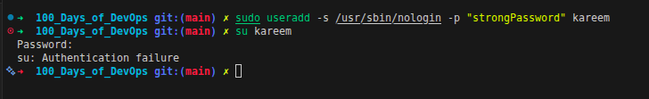
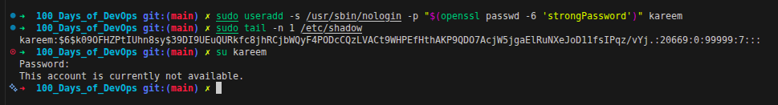

<div align="left">
  
  <h1>Day_001 | User Setup with Non-Interactive Shell</h1>
</div>


## Outlines
- [Task Objective](#the-objective-of-this-lab-is-to)
- [Core Concepts (Theoretical Background)](#core-concepts-theoretical-background)
  - [Shell Classifications](#shell-classifications)
  - [System Shells for Restricted Users (/nologin vs /false)](#system-shells-for-restricted-users-nologin-vs-false)
- [Lab Solution & Commands](#lab-solution--commands)
- [Key Learnings & Notes](#key-learnings--notes)
- [Security Best Practices](#security-best-practices)

---


## **The objective of this lab is to:**

<div align="center">
    <h1>"Create a new user with a Non-Interactive Shell"</h1> <h3>meaning the user cannot log in and get a terminal prompt.</h3>

</div>

---

## Core Concepts (Theoretical Background)

### Before executing the task, it's crucial to understand how Linux categorizes Shells.

The **Shell** is the program that interprets our commands to the **Kernel**, while the **Terminal** is just the interface we type in.

### Shell Classifications

Here are the main shell classifications you will encounter:

1. **Login Shell:** 
   The first terminal you open when logging into the system (e.g., via SSH or switching users). It sets up the entire environment by reading files like `/etc/profile`, `~/.bash_profile`, and `~/.profile`.
   
2. **Non-login Shell:**
   Opened when you are already logged in (like opening a new terminal tab). It skips the heavy profile files and only reads `~/.bashrc`, which usually contains Aliases.

3. **Interactive Shell:**
   A shell waiting for human input. It features Tab-autocomplete, a prompt, and expects a user to interact with it.

4. **Non-interactive Shell:**
   A shell running in the background to execute scripts (e.g., automated `cron` jobs). It does not load interactive files like `~/.bashrc`.
   > **Note:** This is why scripts working perfectly in your terminal might fail in `cron`. Always use absolute paths (like `/usr/bin/python3`) in automation!

### System Shells for Restricted Users (/nologin vs /false)

When creating a user without passing the `-s` flag to specify a custom shell, Linux automatically assigns the default system shell (usually `/bin/bash` or `/bin/sh`). To restrict a user from accessing an interactive shell, Linux provides two special binaries:

* **`/usr/sbin/nologin` (or `/sbin/nologin`):** 
  Politely rejects the login attempt. When a user tries to log in via SSH or `su`, it displays a message (e.g., *"This account is currently not available."*) and immediately closes the connection with an exit status of `1`.
* **`/bin/false` (or `/usr/bin/false`):** 
  Silently rejects the login attempt. It does absolutely nothing, prints no output/message, and immediately exits with a status code of `1` (failure).

> **Best Practice:** `/nologin` is preferred for standard service accounts because it gives user-friendly feedback, whereas `/bin/false` is strictly used when you want absolute silence and zero interaction.

---

## Lab Solution & Commands

### The Intuitive (But Wrong) Approach:
Initially, I tried creating the user and setting the password using the `-p` flag directly:


```bash
sudo useradd -s /usr/sbin/nologin -p "strongPassword" kareem
```
#### Why use password even if the user is non-interactive?
* Because the system still needs a password hash for authentication, even if the user cannot log in. and also for checking if the user is locked or not.

The command succeeded, but when attempting to switch to the user using the exact password, it failed with an `Authentication Failure` insted of `This account is currently not available`.

<div align="center">
  
</div>

### Why did it fail?
The `-p` flag expects an already **hashed** password, not plain text. Because I passed plain text, Linux literally saved the word "strongPassword" inside `/etc/shadow`. When I tried to log in, Linux hashed my input and compared the new hash to the plain text word.. which obviously didn't match!

### The Correct Approach:
To fix this, we must pass the password through a hashing algorithm (like SHA-512) before handing it to the `useradd` command using `openssl`:

```bash
sudo useradd -s /usr/sbin/nologin -p "$(openssl passwd -6 'strongPassword')" kareem
```

<div align="center">
  
</div>

> ### The check is now successful, and the user is created with a non-interactive shell.

---

## Key Learnings & Notes

*   **Authentication Flow:** Linux never encrypts passwords; it **hashes** them. Encryption is **two-way** (can be decrypted), but Hashing is **one-way**. Linux hashes your input during login and compares it to the stored hash in `/etc/shadow`.
```text
+---------------------+
|      User Input     |
| (Username + Passwd) |
+---------------------+
           |
           v
+---------------------+
|  Reads /etc/shadow  |
|  - Algorithm ($6$)  |
|  - Stored Salt      |
|  - Stored Hash      |
+---------------------+
           |
           v
+------------------------------------+
|       Computes Input Hash          |
| Hash = SHA-512(Typed Pass + Salt)  |
+------------------------------------+
           |
           v
+------------------------------------+
|           Comparison               |
| Does Input Hash == Stored Hash?    |
+------------------------------------+
       /          \
      /            \
    YES             NO
    /                \
   v                  v
+----------+    +-----------------------+
|  Access  |    | Authentication        |
| Granted  |    | Failure- Access Denied|
+----------+    +-----------------------+
```

*   **Hash Identification:** How does Linux know which algorithm to use during login? It leaves a marker at the beginning of the hash in `/etc/shadow`. For example, `$6$` means SHA-512, and `$1$` means **MD5**.

*  **Salt Usage:** Linux uses a **salt** (random string) to make the hash unique, even if two users have the same password. This prevents attackers from using precomputed hash tables (like rainbow tables) to crack passwords.
---


## Security Best Practices

Using `-p` with `useradd` (even with `openssl`) leaves traces in the bash history and can be seen by other users running `ps -ef`. The most secure way is to create the user first, then use the interactive prompt:
    ```bash
    sudo passwd kareem
    ```

---

## Deep Dive References

*   [**Terminals and Shells in Linux**](https://github.com/k-fathi/learn-DevOps-tools/blob/main/01_Learn-Linux/Admin_1/00_Terminals_and_Shells_in_Linux.md): Understand the fundamental differences between terminals, shells, and how environments differ across login and non-interactive sessions.
*   [**Shell files and Scripts**](https://github.com/k-fathi/learn-DevOps-tools/blob/main/01_Learn-Linux/Admin_1/11_Shell_files_and_Scripts.md): Learn about how bash configuration files and profile scripts orchestrate user sessions.
*   [**Managing Local Users**](https://github.com/k-fathi/learn-DevOps-tools/blob/main/01_Learn-Linux/Admin_1/12_Managing_Local_Users.md): Discover how Linux handles users, permissions, and the system tools used for complete local user administration.

---
t
### **KodeKloud 100 Days of DevOps:** [**Here**](https://engineer.kodekloud.com/practice)

### **Main Learning Repository:** [**learn-DevOps-tools**](https://github.com/k-fathi/learn-DevOps-tools)
