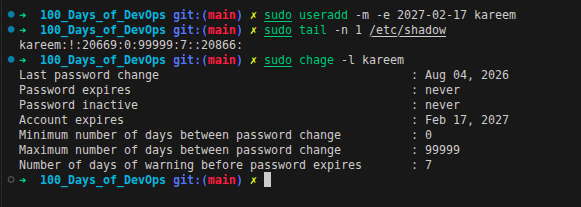

<div align="left">
  
  <h1>Day_002 | Account Expiry and Unix Epoch Time</h1>
</div>

## Outlines
- [Task Objective](#the-objective-of-this-lab-is-to)
- [Core Concepts (Theoretical Background)](#core-concepts-theoretical-background)
  - [The Unix Epoch Time](#the-unix-epoch-time)
  - [The Y2K38 Problem](#the-y2k38-problem)
- [Execution Steps](#execution-steps)
- [Key Learnings & Notes](#key-learnings--notes)

---

## **The objective of this lab is to:**

<div align="center">
    <h1>"Create a user and set a specific account expiry date"</h1> <h3>meaning the account will automatically become disabled on a predefined date.<h3>
</div>

---

## Core Concepts (Theoretical Background)

### Before diving into the shadow file, we need to understand how Linux perceives time.

Linux does not store dates natively as "Days, Months, and Years" because formatting differs across regions and handling leap years/months is computationally complex. Instead, it relies on a single integer counter.

### The Unix Epoch Time
The Unix Epoch is the number of **seconds** that have elapsed since **January 1, 1970, at 00:00:00 UTC**. This specific date was chosen as an arbitrary starting point for Unix systems. 
Whenever you check the time in Linux (e.g., using the `date +%s` command), it returns a massive integer representing the seconds since that exact moment.

### The Y2K38 Problem
Because 32-bit systems store this Epoch time as a signed 32-bit integer, the maximum value it can hold is `2,147,483,647`. 
On **January 19, 2038, at 03:14:07 UTC**, this counter will overflow. The next second, it will flip to a negative number, causing older 32-bit systems to interpret the date as the year **1901**. Modern 64-bit architectures solve this by providing enough bits to count for billions of years into the future.

---

## Execution Steps

### Setting the Expiry Date
To create a new user and set the account expiration date to `2027-02-17`, we use the `useradd` command with the `-e` (expire) flag:

```bash
sudo useradd -m -e 2027-02-17 kareem
```

After executing the command, I checked the `/etc/shadow` file to see how the system saved this date:

```bash
sudo grep karim /etc/shadow
```
**Output:**
```text
karim:!:20669:0:99999:7::20866:
```

The `8th` field in the shadow file is `20866`, which represents the account expiration date.
The `chage -l` command can also be used to view the account expiration date in a human-readable format:

```bash
sudo chage -l kareem
```


<div align="center">
  
</div>

> ### Verify the Lab Solution: see the filed `Account expires` in the output of `chage -l kareem` command.

---

## Key Learnings & Notes

* **Days vs. Seconds in `/etc/shadow`:** 
  If you convert `20866` as seconds from the Epoch, you get a date in early January 1970 (less than 6 hours after the Epoch started). This is because the `/etc/shadow` file is an exception in Linux: **it stores time in Days, not Seconds.**
  
* **Why Days?**
  1. **Business Logic:** Security policies require passwords to expire in "90 days," not "90 days, 3 hours, and 12 seconds." Day-level precision is exactly what is needed.
  2. **Storage Efficiency:** Using days keeps the integer significantly smaller, providing a much larger time span before hitting any architectural limits.
  3. **Timezone Independence:** Storing absolute days removes the headache of calculating exact second-based expirations across different timezones.

---

### **KodeKloud 100 Days of DevOps:** [**Here**](https://engineer.kodekloud.com/practice)
