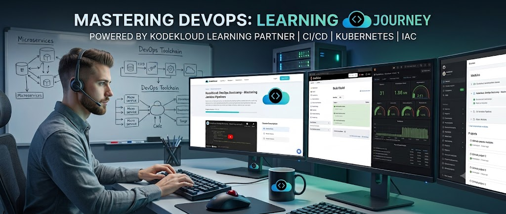

<div align="center">
  
  <h1>KodeKloud - 100 Days of DevOps</h1>
  <p>Documenting my journey, deep dives, and daily labs with <a href="https://engineer.kodekloud.com/">KodeKloud</a>.</p>
</div>

---

## About This Repository
This repository is my personal knowledge base for the **#100_Days_of_DevOps** challenge. Instead of just passing labs, I am documenting the "Under the Hood" concepts, fixing configurations, understanding Linux architecture, and building a solid DevOps mindset.

**Related Repository:** Check out my comprehensive [DevOps Documentations Repository (learn-DevOps-tools)](https://github.com/k-fathi/learn-DevOps-tools) where I document my complete learning journey.

---

## 📂 Repository Structure
To keep things neat and easy to navigate, every day has its own dedicated directory (Zero-padded for proper sorting):

```text
.
├── images/
├── Day_001/
│   ├── README.md
├── Day_002/
│   ├── README.md
├── Day_003/
│   ├── README.md
|   ...
|
└── README.md (You are here)
```


## My Progress & Logs

Here is the log of all the labs I've completed so far, along with the detailed documentation and my LinkedIn posts discussing the core concepts:

| Day | Topic / Lab Objective | Solution  |
|:---:|:---|:---:|
| **001** | User Setup with Non-Interactive Shell | [📖 View Lab](./Day_001/README.md) |
| **002** | Account Expiry and Unix Epoch Time | [📖 View Lab](./Day_002/README.md) |
| **003** | Disable Direct SSH Root Login | [📖 View Lab](./Day_003/README.md) |
| **004** | Permissions and Special Permissions | [📖 View Lab](./Day_004/README.md) |
| **005** | SELinux Fundamentals: DAC vs MAC | [📖 View Lab](./Day_005/README.md) |
| **006** | Cron Jobs | [📖 View Lab](./Day_006/README.md) |
| **007** | Password-less SSH and Bastion Hosts | [📖 View Lab](./Day_007/README.md) |
| **...** | *More coming soon...* | ... | 

---

## 🌐 Connect With Me

I'm **Karim Fathy Abd El-Hady**. Let's connect and talk about Linux, Automation, and Cloud Native technologies!

*   **LinkedIn:** [Karim Fathy AbdElhady](https://www.linkedin.com/in/kareemfathy/) 
*   **My DevOps Portal:** [devops-galaxy.me](https://devops-galaxy.me)
*   **Learn DevOps Tools Repository:** [learn-DevOps-tools](https://github.com/k-fathi/learn-DevOps-tools)

<br>

<div align="center">
  <i>"Don't just run commands, understand the architecture."</i>
</div>